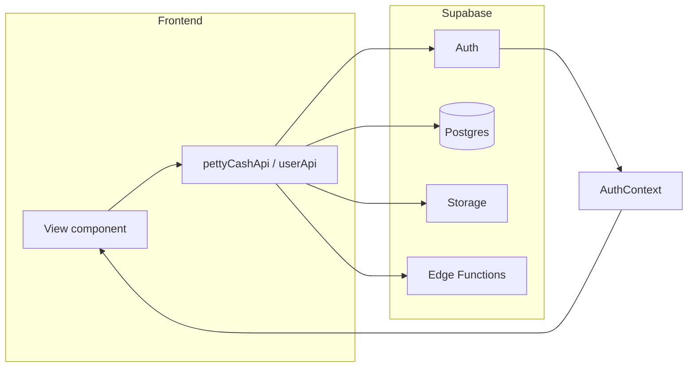
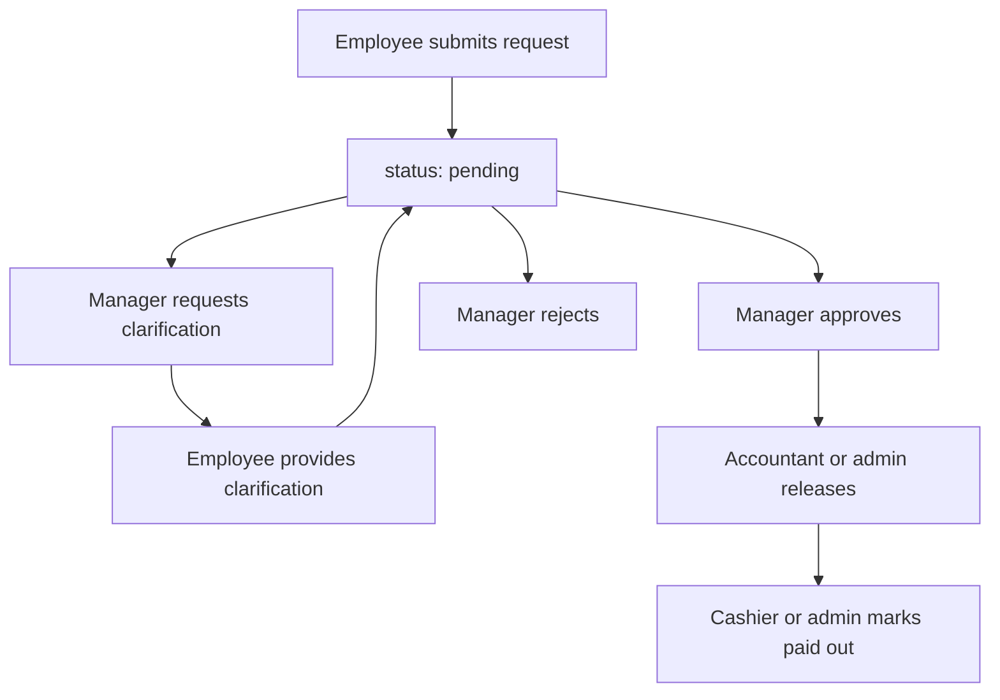
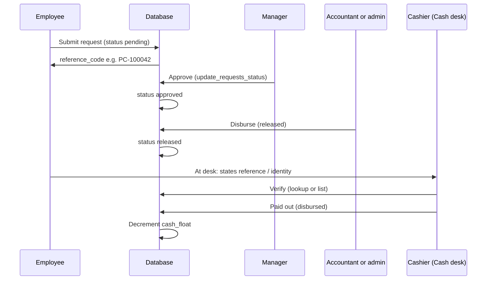

# PETTY SYNC — Technical Documentation (HND Defense)

This document provides a comprehensive technical overview of **PETTY SYNC**, a web-based petty cash management application. It is written for both non-technical readers and a specialized jury, with high-level explanations and detailed technical references where appropriate.

---

## 1. Project Overview and Problem Statement

### 1.1 What Is It?

**PETTY SYNC** is a web-based application for managing petty cash in **FCFA** (Franc CFA). It enforces a **three-step payout**: **managers or accountants** (or admins) approve pending requests, **accountants or admins** then release approved requests to the cash desk (`released`), then **cashiers** verify the **reference code** and mark **paid out** (`disbursed`, which decrements the float). **Admins** additionally manage users and the float.

- **Employees** submit requests (amount, purpose, category, optional receipt). Each request receives a unique **reference code** (e.g. `PC-100042`) for identification at payout.
- **Managers** review pending requests and can approve, reject, or ask for clarification.
- **Accountants or admins** use **Disbursements**: **To disburse** moves `approved` → `released` so the request appears on the cash desk; **History** shows rows awaiting the cashier and paid-out rows.
- **Cashiers** (created by admin with an **employee code**) use the **Cash desk** only for requests in **`released`** status; they confirm the reference and click **Paid out** (`disbursed`).
- **Accountants** share **Pending Queue** with managers (approve, reject, request clarification), plus the same reporting and **Disbursements** as admins except **User Management** and **Float Management**.
- **Admins** have accountant capabilities plus user/role management, float top-up, and may mark **paid out** from **`released`** when needed (same RPC as cashier).

PETTY SYNC provides an overview dashboard, statistics and trends on disbursed spending, and export of disbursement data to Excel or PDF.

### 1.2 The Problem

Many organizations still track petty cash with paper forms and spreadsheets. This leads to:

- **Manual, error-prone tracking** — handwritten logs and loose receipts are easy to misplace or miscopy.
- **No clear audit trail** — who approved what and when is hard to prove.
- **Delays** — paper forms must be physically passed between requester, manager, and cashier.
- **Poor visibility** — no single view of pending requests, current float, or spending by category or time.
- **Risk of misuse** — weak controls make it harder to enforce approval rules and detect anomalies.

These pain points motivated a single, digital solution that enforces workflow and leaves a traceable record.

### 1.3 The Solution

PETTY SYNC addresses these issues by:

- **Centralizing requests** — All requests are created and stored in a database, with optional receipt attachments stored securely.
- **Enforcing a clear workflow** — A request moves through defined states: pending → (optional clarification) → approved or rejected → **released** (finance) → **disbursed** (cash paid out). Only authorized roles can perform each step.
- **Maintaining an audit trail** — Approvals, rejections, and clarifications are recorded in a timeline and audit table, so every decision is attributable and reviewable.
- **Tracking the cash float** — Admins see the current balance and can top it up; disbursements automatically decrement the float so the system reflects real cash movement.
- **Providing role-specific dashboards** — Overview, statistics, trends, and export give visibility into spending and history, with access limited by role.

The result is a single platform that reduces manual work, increases transparency, and supports accountability—without requiring a custom server, since authentication, database, storage, and serverless functions are provided by Supabase.

---

## 2. Tech Stack Justification

The project uses **React with Create React App and JavaScript** (not Next.js or TypeScript). The backend is entirely **Supabase** (auth, Postgres, storage, Edge Functions); there is no separate Node.js or other custom server.

### 2.1 Technologies Used

| Technology | Role in the Project | Purpose |
|------------|---------------------|---------|
| **React 19** | UI components and views | Builds the entire user interface (login, overview, request forms, queues, disbursements, statistics, export, user and float management). |
| **Create React App (CRA)** | Build tool and dev server | Supplies a zero-config build, scripts (`npm start`, `npm run build`, `npm test`), and a single-page application (SPA) bundle. |
| **JavaScript** | Implementation language | All frontend code is written in JavaScript. TypeScript was not used to keep the HND scope manageable and to prioritize delivery; it would be a strong candidate for a next phase. |
| **React Router v7** | Client-side routing | Defines routes (e.g. `/`, `/submit-request`, `/pending`, `/disbursements`, `/cashier`) and integrates with the layout and sidebar. Role-based visibility is implemented by filtering nav items and redirecting unauthorized users. |
| **Supabase** | Backend platform | Provides authentication (email/password, JWT), PostgreSQL database with Row Level Security (RLS), storage for receipts, and Edge Functions (Deno) for admin-only operations (create/delete user). |
| **Tailwind CSS** | Styling | Utility-first CSS with a small set of custom colours (e.g. brand-dark, navy, accent) in `tailwind.config.js`. Keeps styling consistent and avoids large custom CSS files. |
| **Recharts** | Charts | Powers the Statistics view (pie chart by category) and Trends view (bar chart by date) for disbursed amounts. |
| **react-hot-toast** | Notifications | Shows short success or error messages after actions (e.g. “Request submitted”, “Failed to approve”) without blocking the UI. |
| **@react-pdf/renderer** | PDF export | Renders the disbursement report as a PDF in the browser for download in the Export view. |
| **xlsx** | Excel export | Generates an Excel file from disbursement data in the Export view. |

### 2.2 Justification for the Jury

- **React + CRA (not Next.js):** The application is a SPA that talks to Supabase over HTTP. There is no need for server-side rendering (SSR) or a custom Node server. Create React App was chosen for fast setup and standard tooling; Next.js would be considered if the project later required SSR, API routes, or more advanced routing.

- **JavaScript (not TypeScript):** The choice prioritizes development speed and scope for the HND. For production hardening, TypeScript would improve type safety for monetary amounts, API responses, and role/permission checks.

- **Supabase (not a custom backend):** Supabase provides auth, database, RLS, storage, and serverless functions in one platform. This avoids building and maintaining a separate backend while still allowing secure, role-aware logic via RPCs and Edge Functions.

- **Tailwind CSS:** Enables rapid, consistent UI development and keeps the design system in one config file. No separate component library was required for the current feature set.

- **Recharts:** Sufficient for internal analytics (category breakdown, time trends). For very large datasets or real-time dashboards, additional optimization or a dedicated analytics stack could be considered later.

---

## 3. System Architecture and Workflow

### 3.1 Folder Structure and Data Flow

**Frontend structure (simplified):**

- **`src/App.js`** — Root component: auth gate (loading → login if no user → main app), and React Router routes.
- **`src/context/AuthContext.jsx`** — Holds current user and profile (including `role`); consumed by layout and views.
- **`src/components/`** — Layout (AppLayout, Sidebar), views (OverviewView, SubmitRequestView, MyRequestsView, PendingQueueView, DisbursementsView, CashierView, StatisticsView, TrendsView, ExportView, UserManagementView, FloatManagementView), Login, RequestDetailsDialog, AddUserModal.
- **`src/utils/`** — `supabaseClient.js` (Supabase client), `pettyCashApi.js` (requests, analytics, float, profiles, RPCs), `userApi.js` (create/delete user via Edge Functions, employee ID RPCs).

**Backend / Supabase:**

- **`supabase/migrations/`** — SQL migrations: profiles, cash_float, RLS, RPCs (e.g. `get_cash_float`, `update_cash_float`, `list_float_topups`, `list_admin_closed_requests`, `list_profiles`, `update_user_role`, `update_requests_status`), `reference_code`, status **`released`** (two-step payout, migration `012_released_status_disburse_flow.sql`), accountant on **Pending Queue** (`013_accountant_pending_queue.sql`), **cashier** role and RPC hardening, request_timeline, triggers (e.g. `on_cash_disbursement`).
- **`supabase/functions/`** — Edge Functions: `create-user`, `delete-user` (admin-only, called with JWT).

**Data flow (high level):**



- User actions in a view call functions in `pettyCashApi.js` or `userApi.js`.
- Those functions use the Supabase client (which sends the user’s JWT) to call Auth, PostgREST/RPC, Storage, or Edge Functions.
- Auth state is read in AuthContext and exposed as `user`, `profile`, and `role` to the layout and views for routing and permission checks.

### 3.2 User Roles and Permissions

| Role | Permissions | Main routes |
|------|-------------|-------------|
| **Employee** | Submit requests; view and manage own requests (including providing clarification); view Overview (balance/pending may show 0 if RLS restricts). | Overview, Submit Request, My Requests |
| **Cashier** | **Cash desk** only (`CashierView`, route `/cashier`): three tabs — **Pay out** (balance, reference lookup, **`released`** queue, **Paid out** → `disbursed`), **Top up** float (same RPC as admin, audited), **Activity log** (read-only history). No Overview, Statistics, or Export; those routes redirect to `/cashier`. Logs in with **Employee** mode (User ID + email + password). | `/cashier` |
| **Manager** | View pending and clarification_requested requests; approve, reject, or request clarification; view Overview. | Overview, Pending Queue |
| **Accountant** | **Pending Queue** (same as manager: approve, reject, clarification); **Disbursements** (release `approved` → `released`; history); Overview, Statistics, Trends, Export; read cash float via RPC. Does **not** mark `disbursed` (cashier/admin only). No User or Float management. | Overview, Pending Queue, Disbursements, Statistics, Trends, Export |
| **Admin** | Accountant capabilities; list/create/delete users; change roles; float top-up and **activity log**; may mark **paid out** (`disbursed`) from **`released`** like a cashier. | Overview, Disbursements, Statistics, Trends, Export, User Management, Float Management |

Route visibility is defined in the sidebar by filtering items by `role`; views that are role-specific (e.g. Submit Request, Float Management) redirect to `/` if the user’s role is not allowed.

### 3.3 Lifecycle of a Single Request



1. **Creation:** Employee submits the form in SubmitRequestView. `createRequest()` in pettyCashApi inserts a row into `requests` with status `pending` and optionally uploads a receipt to the `receipts` storage bucket. A **BEFORE INSERT** trigger assigns a unique **`reference_code`** (e.g. `PC-100042`) for window verification.

2. **Manager or accountant actions:** In PendingQueueView or RequestDetailsDialog, a **manager**, **accountant**, or **admin** can:
   - **Approve** — `updateRequestStatus(id, { status: 'approved' })` calls the `update_requests_status` RPC; the app also inserts into `audit_trail` and `request_timeline`.
   - **Reject** — Same RPC with `status: 'rejected'` and required `rejection_reason`; again with audit and timeline inserts.
   - **Request clarification** — `requestClarification()` inserts a timeline event and sets status to `clarification_requested`. The employee then uses My Requests to respond via `provideClarification()` (timeline event + optional attachments); status returns to `pending`.

3. **Release for pickup:** An **accountant** or **admin** uses **Disbursements → To disburse** and calls `updateRequestStatus(id, { status: 'released' })`. The RPC allows **`released`** only from **`approved`**. The cash desk does not show the request until this step completes.

4. **Paid out:** In **CashierView**, the cashier marks a **`released`** request via `updateRequestStatus(id, { status: 'disbursed' })`. An **admin** may do the same from **`released`** (e.g. override). The RPC allows **`disbursed`** only when the caller is **cashier** or **admin** and the row is **`released`**. The trigger `on_cash_disbursement` decrements `cash_float.current_balance` by the request amount.

5. **Audit:** Approve, reject, **released**, and **disbursed** actions write to `audit_trail` and `request_timeline` (where configured). The timeline is used by RequestDetailsDialog to show the full history of the request.

### 3.4 Cash desk panel and flow from request to paid out

The **cashier** role handles **physical cash** only after **finance** has set status to **`released`**. The UI is **`CashierView`** (“Cash desk”), reachable only at **`/cashier`** when `profile.role === 'cashier'`. Other views redirect cashiers to `/cashier`.

**End-to-end flow (happy path):**



1. **Request and reference** — The employee submits a request in **Submit Request**. A trigger assigns a unique **`reference_code`**. The employee sees status messaging in **My Requests** / **Request details**: after **`released`**, they give the code to the cashier; while only **`approved`**, finance must disburse first.
2. **Approval** — A **manager**, **accountant**, or **admin** sets **`approved`** via `update_requests_status`.
3. **Disbursements (accountant/admin)** — **Disbursements → To disburse** lists **`approved`** rows. **Disburse** calls **`updateRequestStatus(id, { status: 'released' })`**. **History** shows **Awaiting cashier** (`released`) and **Paid out** (`disbursed`).
4. **Cash desk — Pay out tab** — The cashier sees **`released`** rows via **`getReleasedForPayoutRequests()`**. **Look up by reference** uses **`getReleasedRequestByReferenceCode`** (only **`released`** qualifies). **Paid out** calls **`disbursed`**; the trigger decrements **`cash_float`**.
5. **Cash desk — Top up / Activity log** — Unchanged (float top-up RPCs; **`getAdminCashbookHistory()`** for the ledger).
6. **Admin** — May mark **`disbursed`** from **`released`** like a cashier; cannot skip **`released`** via the RPC.

This split matches operations: **managers** authorize spend; **finance** releases to the desk; **cashiers** hand over cash; **admins** retain user/float governance and optional paid-out override from **`released`**.

---

## 4. Key Features and Implementation

### 4.1 Authentication

- **Provider:** Supabase Auth (email/password). No self-service sign-up; users are created by an admin (Edge Function).
- **Login:** The Login component supports two modes:
  - **Employee:** User enters User ID (employee_id), email, and password. After sign-in, the app checks that the profile’s `employee_id` matches the entered ID; otherwise it signs the user out and shows “User ID does not match”. **Cashiers** use this same mode (they are provisioned with an employee code by admin).
  - **Admin:** Email and password only (no User ID check)—for managers, accountants, and admins.
- **Session and role:** AuthContext uses `getSession()` and `onAuthStateChange()` to keep the session in state, then loads the user’s profile from the `profiles` table. The UI uses `profile.role` (and optionally `employee_id`) for sidebar visibility and redirects.

### 4.2 Request Management

- **Creation:** SubmitRequestView validates amount (must be a positive number), purpose (required), and category (from a fixed list). pettyCashApi `createRequest()` re-checks category and optional receipt upload; it inserts into `requests` with `requester_id` from the authenticated user. Example of client-side amount validation:

```javascript
const amt = Number(amount);
if (isNaN(amt) || amt <= 0) {
  setError("Amount must be a positive number");
  return;
}
```
- **Listing and filtering:**
  - Employee: `getMyRequests()` — requests where `requester_id` equals current user.
  - Manager/Accountant/Admin (pending queue): `getPendingRequests()` — status in `pending`, `clarification_requested`, with requester profile.
  - Accountant/Admin (to disburse): `getAwaitingDisbursementRequests()` — `status = 'approved'`.
  - Cashier desk: `getReleasedForPayoutRequests()` — `status = 'released'`; `getReleasedRequestByReferenceCode(code)` for desk verification.
  - History (Disbursements): `getReleasedForPayoutRequests()` and `getDisbursedRequestsRecent()`; export still uses `getDisbursedRequestsForExport({ startDate, endDate })`.
- **Status changes:** All status updates go through the `update_requests_status` RPC, which enforces **manager/accountant/admin** for **approve/reject**, **accountant/admin** for **`released`** (from **`approved`**), and **cashier/admin** for **`disbursed`** (from **`released`** only). Rejection requires a non-empty `rejection_reason` (enforced in the API layer). Clarification uses `requestClarification()` and `provideClarification()`. The client calls the RPC like this:

```javascript
const { data: rawRows, error } = await supabase.rpc("update_requests_status", {
  p_request_id: requestId,
  p_status: status,        // 'approved' | 'rejected' | 'released' | 'disbursed'
  p_manager_id: user.id,   // for approve/reject only
  p_rejection_reason: rejection_reason?.trim() ?? null
});
```

### 4.3 Reporting and Analytics

- **Overview:** Fetches (in parallel) cash float (`get_cash_float`), pending requests (`getPendingRequests`), and analytics for the current month (`getAnalyticsData`). It displays three cards: Total Balance, Pending (sum of amounts), Disbursed (month). The **Awaiting cash pickup** section lists **`released`** requests (finance has released them; cashier has not yet marked paid out).
- **Statistics:** Uses `getAnalyticsData()` (disbursed requests only), aggregates by category, and renders a Recharts PieChart. A helper adjusts proportions for equal values so segments are visually distinct.
- **Trends:** Same analytics source, aggregated by date, rendered as a Recharts BarChart.
- **Export:** User selects optional date range; the app calls `getDisbursedRequestsForExport()`, then generates either an Excel file (xlsx) or a PDF (via @react-pdf/renderer) for download.

### 4.4 History and Audit

- **Request timeline:** `getRequestTimeline(requestId)` returns the request plus events from the `request_timeline` table. The “created” event is derived from the request row; clarification and approval/rejection events come from the table. The list is sorted by time and shown in RequestDetailsDialog. RLS on `request_timeline` restricts who can read or insert by role and relationship to the request.
- **Audit trail:** On approve, reject, **released**, and **disbursed**, the app inserts into `audit_trail` (request_id, action, performed_by, details) where implemented. This supports accountability; a dedicated audit report screen could be added later.

### 4.5 Balance and Float

- **Cash float:** Stored in a single-row table `cash_float` (e.g. `id = 1`, `current_balance`, `updated_at`). Direct table access is blocked by RLS. Only RPCs are used:
  - **Read:** `get_cash_float` — allowed for admin, accountant, and **cashier**; returns current balance.
  - **Top-up:** `update_cash_float(amount_add)` — **admin or cashier**; adds to `current_balance` and writes the same audit trail as an admin top-up.
  - **Top-up history:** `list_float_topups` — **admin or cashier**; supports the Cash desk “Recent top-ups” table.
- **Disbursement (cash out of float):** When a request’s status is updated to **`disbursed`** from **`released`**, the trigger `on_cash_disbursement` runs and subtracts the request amount from `cash_float.current_balance`. The intermediate **`released`** step does not change the float. The `cash_float` table has a check constraint so balance cannot go negative; business logic could additionally prevent payout when balance would be insufficient (e.g. inside an RPC).

### 4.6 User Management (Admin)

- **List:** `list_profiles` RPC (admin-only) returns profiles joined with `auth.users` to include email. Used by UserManagementView.
- **Create user:** Client calls the `create-user` Edge Function with JWT. The function verifies the caller is admin, then uses the Supabase service role to create the auth user and insert a profile (with optional `employee_id` in the 10000–99999 range).
- **Delete user:** `delete-user` Edge Function (admin-only) removes the user from auth and cleans up related data (e.g. profile).
- **Change role:** `update_user_role` RPC (admin-only) updates the `role` column on the profile (valid roles include **`cashier`**).
- **Cashiers:** Created like employees with an **`employee_id`** so they sign in via **Employee** mode on the Login screen; only the **Cash desk** nav item appears for that role.

---

## 5. Potential Defense Q&A (Technical and General)

### Security

**Q: How do you protect user data and prevent unauthorized fund requests?**

- All API access is authenticated via Supabase Auth (JWT). The database uses Row Level Security (RLS) on tables such as `profiles`, `cash_float`, and `request_timeline` so that only allowed rows are visible. Sensitive operations (float read/update, list/update users, request status update) go through SECURITY DEFINER RPCs or Edge Functions that check the caller’s role (from `profiles`) before performing the action. The UI also enforces role-based visibility and redirects, but the real enforcement is on the backend (RPCs and RLS).

**Q: How are receipts stored and who can access them?**

- Receipts (and clarification attachments) are stored in a Supabase Storage bucket (`receipts`). Upload and access use the same authenticated client; bucket policies can be configured to restrict access (e.g. by role or by request ownership). For stricter control, the app could use signed URLs with short expiry instead of public URLs.

### Scalability

**Q: How would the system handle 10,000 transactions per day?**

- The backend is Supabase (PostgreSQL + PostgREST). Scaling would rely on: (1) indexing key columns (e.g. `requests(status)`, `requests(created_at)`, `request_timeline(request_id)`); (2) pagination and limits on list endpoints so the UI never loads the full set; (3) stateless Edge Functions for user management. For much higher load, options include read replicas, caching of summary data (e.g. float, monthly totals), and moving heavy reports to background jobs.

### State and Consistency

**Q: How do you ensure the UI stays in sync with the database?**

- The app does not use Supabase Realtime subscriptions. Each view fetches data on mount (and after mutations where needed). Some views (e.g. DisbursementsView) update local state optimistically after a successful action. For stronger consistency, the app could subscribe to relevant table changes via Supabase Realtime so that open tabs or multiple users see updates immediately.

**Q: What happens if two managers approve the same request at the same time?**

- Status updates go through the `update_requests_status` RPC, which performs a single-row `UPDATE ... WHERE id = p_request_id RETURNING *`. The first commit wins; the second would simply set the same row to `approved` again. The application could extend the RPC to allow only transitions from `pending` or `clarification_requested` to `approved`, and reject the call if the row is already `approved` or `rejected`.

### Edge Cases and Validation

**Q: What happens if a user submits a negative amount?**

- The Submit Request form validates that the amount is a positive number (`amt > 0`) and uses `min="1"` on the number input. The `createRequest()` function in pettyCashApi does not re-check the sign; adding a server-side check (e.g. in a constraint or in an RPC used for creation) would strengthen integrity.

**Q: Is a rejection reason required?**

- Yes. When calling `updateRequestStatus` with `status: 'rejected'`, the client must supply `rejection_reason`; the API returns an error if it is missing or empty. The same rule could be enforced inside the RPC for defence in depth.

**Q: Can the cash float go negative?**

- The `cash_float` table has a check constraint `current_balance >= 0`. The trigger only subtracts on disbursement; it does not check the balance beforehand. So an attempt to disburse more than the current balance would fail at the constraint. For clearer UX, the RPC or trigger could be extended to check balance before updating and return a clear error instead of a constraint violation.

### General

**Q: Why FCFA?**

- FCFA (Franc CFA) is the target currency for the use case (e.g. organization operating in a CFA zone). Amounts are stored and displayed in FCFA; the same design could be extended to multi-currency by adding a currency field and conversion or separate float per currency.

**Q: Why Supabase instead of building your own backend?**

- Supabase provides authentication, a PostgreSQL database with RLS, storage, and Edge Functions in one platform. This reduced development time and operational burden while still allowing secure, role-based logic through RPCs and functions. A custom backend would offer more control but would require implementing auth, API design, and deployment separately.

**Q: How would you add multi-currency or multi-branch support?**

- For multi-currency: add a `currency` (or similar) column to requests and possibly to cash_float (or a separate balance per currency); adjust RPCs and UI to filter/display by currency. For multi-branch: add a `branch_id` (or equivalent) to profiles and requests; restrict visibility and reporting by branch in RLS and in the app. Both are incremental schema and logic extensions rather than a full rewrite.

---

## 6. Conclusion and Future Improvements

### 6.1 Summary

**PETTY SYNC** delivers a digital workflow for petty cash in FCFA: employees submit requests (each with a **reference code**); **managers or accountants** (or admins) handle the **Pending Queue** (approve, reject, clarification); **accountants and admins** **release** approved requests (**`released`**) via **Disbursements**; **cashiers** (or **admins**) mark **paid out** (**`disbursed`**, decrementing the float). Accountants share Pending Queue and reporting with managers/admins but not User or Float management. **Cashiers** use the cash desk (float top-up and **activity log** included). Roles (employee, manager, accountant, admin, **cashier**) are enforced in the UI and in the backend via RLS and RPCs. The app maintains a cash float, an audit trail and request timeline, and provides overview, statistics, trends, and export. It is implemented with React (Create React App, JavaScript) and Supabase and is suitable as an HND project and as a base for production hardening (e.g. additional validation, TypeScript, real-time updates).

### 6.2 Future Improvements

1. **Mobile app or PWA** — The current UI is responsive. Adding a service worker and web app manifest would enable installation and basic offline behaviour. Alternatively, a dedicated mobile app (e.g. React Native or Flutter) could reuse the same Supabase backend and auth.

2. **Multi-currency and/or multi-branch** — Introduce currency and/or branch dimensions in the schema (e.g. on requests and float). Extend RPCs and UI to filter and report by currency or branch, and to manage separate floats or limits per branch.

3. **AI-based spending insights** — Use disbursed data (amounts, categories, dates) to suggest categories, flag outliers, or detect anomalies. This could be implemented as a separate module or integration (e.g. batch job or external API) that reads from the same database or from exported data.
